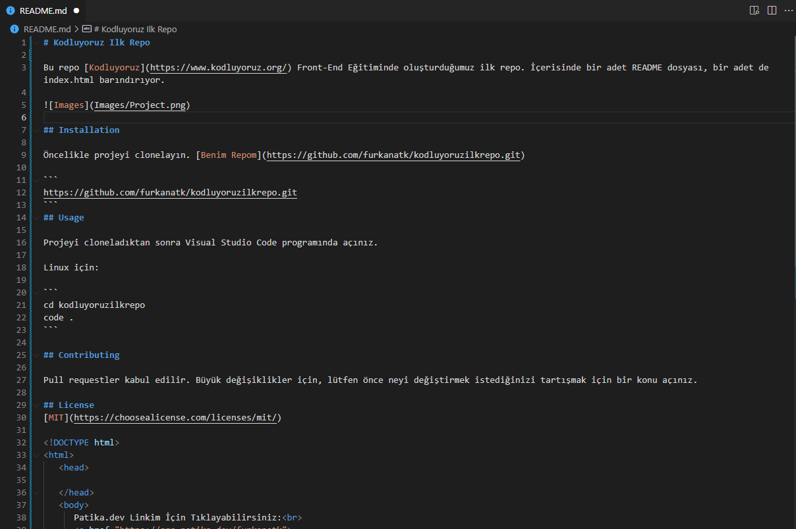

# Kodluyoruz Ilk Repo

Bu repo [Kodluyoruz](https://www.kodluyoruz.org/) Front-End Eğitiminde oluşturduğumuz ilk repo. İçerisinde bir adet README dosyası, bir adet de index.html barındırıyor.

 

## Installation

Öncelikle projeyi clonelayın. [Benim Repom](https://github.com/furkanatk/kodluyoruzilkrepo.git)

```
https://github.com/furkanatk/kodluyoruzilkrepo.git
```
## Usage

Projeyi cloneladıktan sonra Visual Studio Code programında açınız.

Linux için:

```
cd kodluyoruzilkrepo
code .
```

## Contributing

Pull requestler kabul edilir. Büyük değişiklikler için, lütfen önce neyi değiştirmek istediğinizi tartışmak için bir konu açınız.

## License
[MIT](https://choosealicense.com/licenses/mit/)

<!DOCTYPE html>
<html>
   <head>

   </head>
   <body>
      Patika.dev Linkim İçin Tıklayabilirsiniz:<br>
      <a href="https://app.patika.dev/furkanatk">
         
      </a>
   </body>
</html>
